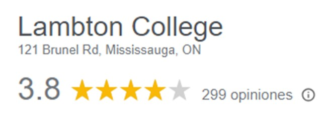
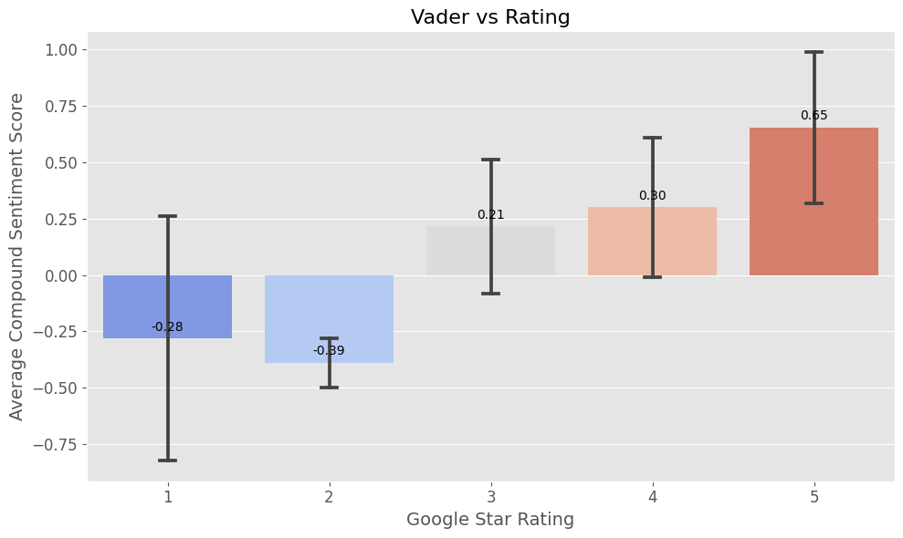
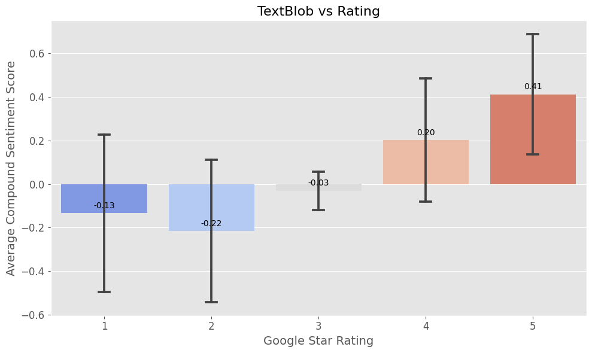

# NLP Project: Sentiment analysis on Google Reviews

# Table of contents

[**Chapter 1: Project Review**](#chapter-1-Project-Review) <br>
<br>
[**Chapter 2: Problem Definition**](#chapter-1-Problem-definition) <br>
<br>
[**Chapter 3: Data Gathering**](#chapter-2-Data-gathering) <br>
<br>
[**Chapter 4: Data Preparation**](#chapter-3-Data-preparation) <br>
<br>
[**Chapter 5: Web Scrapping**](#chapter-4-Web-Scrapping) <br>
<br>
[**Chapter 6: Data Modelling**](#chapter-5-Data-Modelling) <br>
<br>
[**Chapter 7: Conclusions**](#chapter-6-Conclusions) <br>

## Chapter 1: Project Review

Often, when contemplating trying out a new restaurant or purchasing a new product, we turn to reviews to gauge the opinions of others on websites and Google. However, upon careful examination, we may discover that these opinions don't always align with the star ratings assigned to the respective site or item.

This realization sparked our interest in embarking on a project aimed at correlating the number of stars with sentiment analysis of the reviews. We chose to focus on Lambton College initially, but the methodology can be applied to any site or item featured in Google reviews.

## Chapter 2: Problem definition

The prevalent issue in online reviews, particularly on platforms like Google, is the inconsistency between assigned star ratings and the sentiments conveyed in user reviews. When deciding on a new restaurant or product, users often find discrepancies between numerical ratings and the actual experiences described. This misalignment poses a significant challenge: the need for a more accurate correlation between quantitative ratings and qualitative sentiments. Our project, initially centered on Lambton College, aims to address this gap by developing a methodology applicable to any site or item on Google reviews. Our goal is to create a more reliable connection between star ratings and user sentiments, ultimately enhancing the reliability and usefulness of online reviews in decision-making processes.

## Chapter 3: Data Gathering

The Data Gathering process was done through Webscrapping on Lambton College's Google reviews. The data collected was later copied into a CSV file,  resulting in three columns and one-hundred twenty-eight rows. The column names are listed below:

**Name:** Name of the person who writes the review. <br>
**Comment:** Review <br>
**Rating:** Number of stars given. 

## Chapter 4: Data Preparation

With the initial phase of data gathering centered on Lambton College's Google reviews, the subsequent step involved meticulous data preparation. The information extracted through web scraping was organized into a structured format within a CSV file. The dataset comprises three key columns: "Name," representing the reviewer's identity; "Comment," encapsulating the textual content of the reviews; and "Rating," indicating the numerical value of stars awarded by the respective users. This systematic arrangement ensures a coherent and standardized dataset, laying the groundwork for subsequent analyses and the development of our correlation methodology. The emphasis on meticulous data preparation is vital to guaranteeing the accuracy and reliability of insights drawn from the collected information, enabling us to effectively address the identified challenge in online reviews.

## Chapter 5: Web Scrapping

### Importing Libraries for Web Scrapping


```python
import time
from time import sleep
import random
from selenium import webdriver
from selenium.webdriver.chrome.service import Service
from selenium.webdriver.chrome.options import Options
from selenium.webdriver.common.by import By

```
### Web Scrapping Code
```python

scrollingScript = """ 
      document.getElementsByClassName('m6QErb DxyBCb kA9KIf dS8AEf')[0].scroll(0, 500000)
    """

# Create a Chrome options instance
options = Options()
# Set the user agent
options.add_argument("user-agent=Mozilla/5.0 (Macintosh; Intel Mac OS X 10_15_7) AppleWebKit/537.36 (KHTML, like Gecko) Chrome/119.0.6045.200 Safari/537.36")

service = Service(executable_path="chromedriver.exe")
# Initialize the Chrome driver with the specified options
driver = webdriver.Chrome(service=service, options=options)

driver.get("https://www.google.com/maps/place/Lambton+College/@43.6274247,-79.6771064,17z/data=!4m8!3m7!1s0x882b409fb8a947f9:0x418640e93fdafd13!8m2!3d43.6274208!4d-79.6745315!9m1!1b1!16s%2Fg%2F11c1ldpfm2?entry=ttu")

time.sleep(random.uniform(4.0,5.0))

scrolls = 0
while scrolls != 20:
    driver.execute_script(scrollingScript)
    sleep(random.uniform(5,6))
    scrolls += 1

# Locating the 'More' links and clicking them to expand the review texts
more_links = driver.find_elements(By.XPATH, "//button[contains(text(), 'More')]")
for link in more_links:
    try:
        link.click()
        # Wait a bit for the content to load
        time.sleep(1)
    except Exception as e:
        print(f"Error clicking link: {e}")

# Locating the review comments elements
review_elements = driver.find_elements(By.XPATH, "//div[contains(@class, 'MyEned')]/span[@class='wiI7pd']")

# Locating the star rating elements
star_rating_elements = driver.find_elements(By.XPATH, "//span[contains(@class, 'kvMYJc')]")

```

### Generating Dataframe
```python

import pandas as pd

# Locating the names are in an element with a specific class, find them
name_elements = driver.find_elements(By.XPATH, "//div[contains(@class, 'd4r55')]")

# Extracting names, complete reviews, and star ratings
data = []
for name_element, review_element, star_rating_element in zip(name_elements, review_elements, star_rating_elements):
    name = name_element.text  # Get the text directly since the name is the text content of the div
    review_text = review_element.text
    star_rating = star_rating_element.get_attribute('aria-label')
    data.append((name, review_text, star_rating))


# Creating a Pandas DataFrame
df = pd.DataFrame(data, columns=['Name', 'Comment', 'Rating'])

# Display the DataFrame
print(df)

# Optionally, save the DataFrame to a CSV file
df.to_csv('reviews.csv', index=False)


print(df.Comment)

```


Exploring our dataset through visual representation is a crucial step in uncovering patterns, correlations, and potential anomalies. In the initial phase of our analysis, we employed Pyplot and Seaborn to create insightful plots that allowed us to visually grasp the nuances of our data. By utilizing heatmaps and correlation matrices, we delved deeper into the relationships between different variables. These visual tools provided a comprehensive view, enabling us to identify patterns in the data and assess correlations among various attributes. Additionally, this approach facilitated the detection of any inconsistencies or biases in the dataset. Through this thorough exploration, we aim to gain a robust understanding of our data, laying the foundation for informed decision-making and the development of our correlation methodology.

## Chapter 6: Data Modelling

### Importing Libraries 

```python

import pandas as pd
import re
import nltk
from nltk.stem import WordNetLemmatizer
from nltk.corpus import stopwords
import numpy as np
import matplotlib.pyplot as plt
import seaborn as sns
from nltk.sentiment import SentimentIntensityAnalyzer
plt.style.use('ggplot')

```

### Exploratory Data Analysis

```python

df = pd.read_csv('/content/--------------') #csv is in my google drive

df.head(3) 

Name	Comment	      Rating
0	William Thomas	Very Difficult to pass in Lambton College in Mississauga...	1 star
1	Amal M	      Lambton College in Mississauga provided me with...	      5 stars
2	Jasraj Uppal	Lambton College Mississauga is simply exceptional...	      5 stars

df['Rating'] = df['Rating'].str.extract('(\d+)').astype(int) # extract only the numeric part of the column

df.head(3)

Name	Comment	      Rating
0	William Thomas	Very Difficult to pass in Lambton College in Mississauga...	1
1	Amal M	      Lambton College in Mississauga provided me with...	      5
2	Jasraj Uppal	Lambton College Mississauga is simply exceptional...	      5

reviews_dist = df.Rating.value_counts().sort_index() \
    .plot(kind='bar',
          title='Count of Reviews by Stars',
          figsize=(10, 5), color='cadetblue')
reviews_dist.set_xlabel('Review Stars')
plt.show()

```


### Normalizing text

```python

import emoji

# Download required NLTK data
nltk.download('punkt')
nltk.download('wordnet')
nltk.download('stopwords')

# Define a function to handle emojis
def handle_emojis(text):
    # Translate each emoji to text
    text = emoji.demojize(text)
    return text

# Define a text normalization function
def normalize_text(text):
    # Handle emojis
    text = handle_emojis(text)

    # Convert to lowercase
    text = text.lower()

    # Remove punctuation and numbers (keeping emojis)
    text = re.sub(r'[^a-zA-Z\s:]', '', text)

    # Tokenize text
    tokens = nltk.word_tokenize(text)

    # Lemmatization and removing stop words
    lemmatizer = WordNetLemmatizer()
    stop_words = set(stopwords.words('english'))
    normalized_text = ' '.join([lemmatizer.lemmatize(word) for word in tokens if word not in stop_words])

    return normalized_text


# Apply the normalization function to the Comment column
df['Normalized_Comment'] = df['Comment'].apply(normalize_text)


```

### Sentiment analysis with Vader 

```python

# Download VADER lexicon
nltk.download('vader_lexicon')

# Initialize the VADER sentiment intensity analyzer
sia = SentimentIntensityAnalyzer()

# Function to get sentiment scores
def get_sentiment_scores(text):
    return sia.polarity_scores(text)

# Apply the function to the DataFrame
df['Sentiment_Scores'] = df['Normalized_Comment'].apply(get_sentiment_scores)

# Creating columns in the dataframe regarding Sentiment_scores
df['neg'] = df['Sentiment_Scores'].apply(lambda x: x.get('neg', 0))
df['neu'] = df['Sentiment_Scores'].apply(lambda x: x.get('neu', 0))
df['pos'] = df['Sentiment_Scores'].apply(lambda x: x.get('pos', 0))
df['compound'] = df['Sentiment_Scores'].apply(lambda x: x.get('compound', 0))

```
## Vader Results
<strong> Rating </strong> <br>
1   -0.281584 <br>
2   -0.390150 <br>
3    0.214838 <br>
4    0.300059 <br>
5    0.654207 <br>


### Plotting VADER results

```python

# Create the bar plot
plt.figure(figsize=(10, 6))  # Set the figure size for better readability
ax = sns.barplot(x='Rating', y='compound', data=df, errorbar='sd', palette='coolwarm', capsize=0.1)

# Set the title and labels for clarity
ax.set_title('Vader vs Rating', fontsize=16)
ax.set_xlabel('Google Star Rating', fontsize=14)
ax.set_ylabel('Average Compound Sentiment Score', fontsize=14)

# Improve the display of the y-axis and x-axis ticks
plt.yticks(fontsize=12)
plt.xticks(fontsize=12)

# Optional: Annotate each bar with the mean value
for p in ax.patches:
    ax.annotate(format(p.get_height(), '.2f'),
                (p.get_x() + p.get_width() / 2., p.get_height()),
                ha = 'center', va = 'center',
                xytext = (0, 9),
                textcoords = 'offset points')

# Show the plot
plt.tight_layout()  # Adjust the plot to ensure everything fits without overlapping
plt.show()

```




### Sentiment Analysis with Textblob

```python

from textblob import TextBlob

# Function to get sentiment polarity using TextBlob
def get_sentiment_polarity(text):
    blob = TextBlob(text)
    return blob.sentiment.polarity

# Function to get sentiment subjectivity using TextBlob
def get_sentiment_subjectivity(text):
    blob = TextBlob(text)
    return blob.sentiment.subjectivity

# Apply the functions to the DataFrame
df['Sentiment_Polarity'] = df['Normalized_Comment'].apply(lambda x: get_sentiment_polarity(x))
df['Sentiment_Subjectivity'] = df['Normalized_Comment'].apply(lambda x: get_sentiment_subjectivity(x))

# Display the updated DataFrame
print(df[['Rating', 'Sentiment_Polarity']])

```
## Textblob results
<strong> Rating </strong> <br>
1   -0.133950 <br>
2   -0.216250 <br>
3   -0.031250 <br>
4    0.201961 <br>
5    0.412100 <br>
 
### Plotting Textblob results

```python

# Create the bar plot
plt.figure(figsize=(10, 6))  # Set the figure size for better readability
ax = sns.barplot(x='Rating', y='Sentiment_Polarity', data=df, errorbar='sd', palette='coolwarm', capsize=0.1)

# Set the title and labels for clarity
ax.set_title('TextBlob vs Rating', fontsize=16)
ax.set_xlabel('Google Star Rating', fontsize=14)
ax.set_ylabel('Average Compound Sentiment Score', fontsize=14)

# Improve the display of the y-axis and x-axis ticks
plt.yticks(fontsize=12)
plt.xticks(fontsize=12)

# Optional: Annotate each bar with the mean value
for p in ax.patches:
    ax.annotate(format(p.get_height(), '.2f'),
                (p.get_x() + p.get_width() / 2., p.get_height()),
                ha = 'center', va = 'center',
                xytext = (0, 9),
                textcoords = 'offset points')

# Show the plot
plt.tight_layout()  # Adjust the plot to ensure everything fits without overlapping
plt.show()

```





Within this project, our data modeling process involved leveraging specific tools to extract, analyze, and manage our dataset. Selenium played a key role in web scraping, allowing us to efficiently gather data from online sources. For sentiment analysis, we employed VADER and TextBlob, enabling us to delve into the emotional nuances expressed in the textual content of the reviews. In terms of dataset management, Pandas proved to be a robust tool, facilitating seamless organization and manipulation of our collected data. To visualize our findings, we utilized Seaborn and Pyplot, harnessing their capabilities to create informative plots that aid in the interpretation of patterns and correlations within the dataset. This holistic approach to data modeling ensures a comprehensive understanding of the information at hand and supports the subsequent stages of our project.

## Chapter 7: Conclusions

